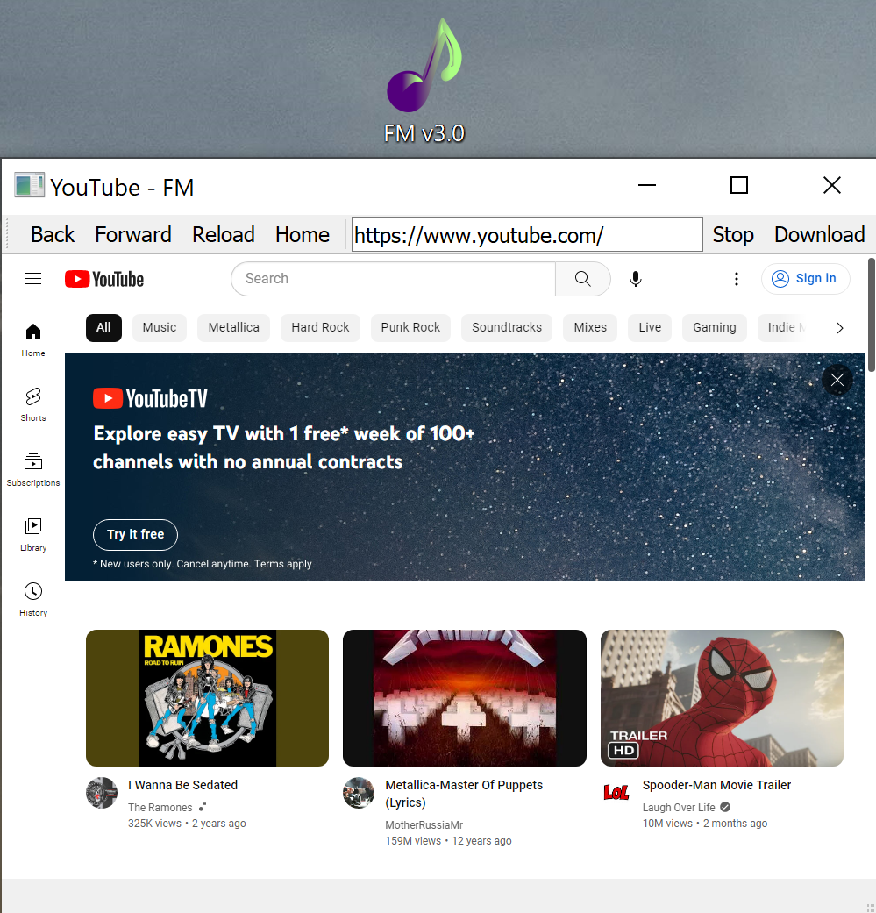
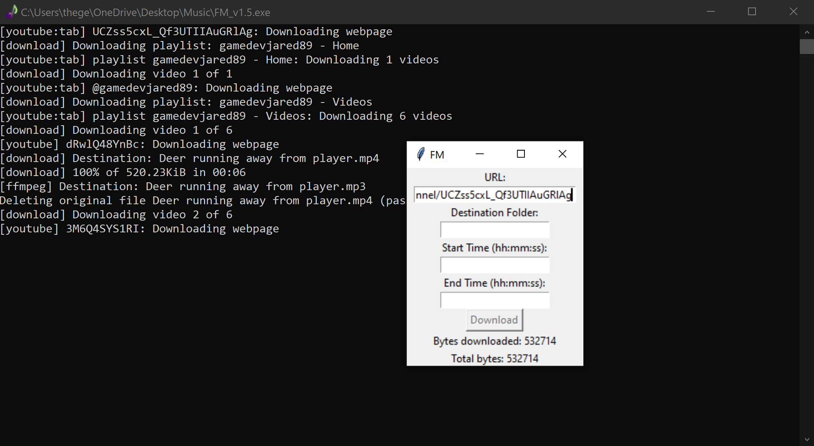

 

<h1>FM Version 3.0</h1>

V 3.0 is here and better than ever! A web browser opens directly in the GUI with a download button 
fixed directly onto the navbar for easy use. Download from releases section.
 

 
<h1>FM Version 2.0</h1>

Version 2.0 keeps the .mp4 as well as extracts .mp3

*NOTICE*: For those without FFmpeg installed on their computer, this will still work for downloading single 
videos. An error will be shown in the terminal and tell the user to install FFmpeg, this is only neccessary if you want FM_2.0 to automatically extract the .mp3 into a separate file. Otherwise, ignore the warning and 
an .mp4 file should be saved to the root folder from where FM_2.0 is opened unless specified to save elsewhere
in the options fields.

<h1>FM Version 1.5</h1>

Works great with single files or whole playlists.

<h2>How To:</h2>

Download and open FM_v1.5 to bring up the GUI. Enter the URL for any youtube-dl compatible media, enter optional data into text boxes, click Download.

<h3>Features:</h3>

1. Choose a save destination (optional)  
2. Define start and stop points of download (optional) 
3. The GUI now also displays download progress so the terminal can be minimized.

*Please use legally and responsibly*

